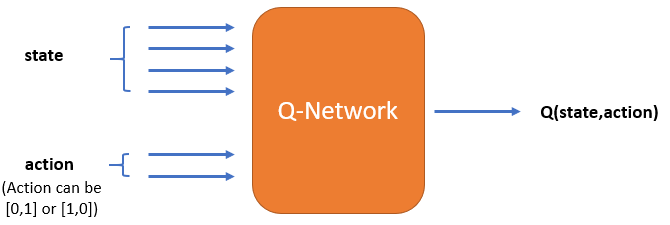
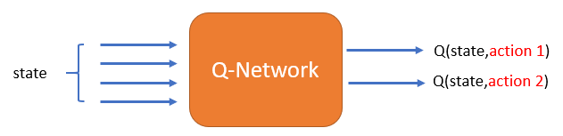

# Problem Statement
You are hired as a Sr. Machine Learning Er. at SuperCabs, a leading app-based cab provider in a large Indian metro city. In this highly competitive industry, **retention of good cab drivers** is a crucial business driver, and you believe that a sound **RL-based system for assisting cab drivers** can potentially retain and attract new cab drivers. 

Cab drivers, like most people, are incentivised by a healthy growth in income. The goal of your project is to build an RL-based algorithm which can **help cab drivers maximise their profits** by improving their decision-making process on the field.

## The Need for Choosing the 'Right' Requests
Most drivers get a healthy number of ride requests from customers throughout the day. But with the recent hikes in electricity prices (all cabs are electric), many drivers complain that although their revenues are gradually increasing, their profits are almost flat. Thus, it is important that drivers choose the 'right' rides, i.e. choose the rides which are likely to **maximise the total profit** earned by the driver that day. 

For example, say a driver gets three ride requests at 5 PM. The first one is a long-distance ride guaranteeing high fare, but it will take him to a location which is unlikely to get him another ride for the next few hours. The second one ends in a better location, but it requires him to take a slight detour to pick the customer up, adding to fuel costs. Perhaps the best choice is to choose the third one, which although is medium-distance, it will likely get him another ride subsequently and avoid most of the traffic. 

There are some basic rules governing the ride-allocation system. If the cab is already in use, then the driver won’t get any requests. Otherwise, he may get multiple request(s). He can either decide to take any one of these requests or can go ‘offline’, i.e., not accept any request at all. 

## Markov Decision Process
Taking long-term profit as the goal, you propose a method based on **reinforcement learning** to optimize taxi driving strategies for **profit maximization**. This optimization problem is formulated as a Markov Decision Process.

You can view the MDP [here](MDP.pdf). The major simplifying assumptions are also mentioned in the file.

In this project, you need to create the environment and an RL agent that learns to choose the best request. You need to train your agent using vanilla Deep Q-learning (DQN) only and NOT a double DQN. You have learnt about the two architectures of DQN (shown below) - you are free to choose any of these.

**
Architecture 1
**

**
Architecture 2
**

There’s a renowned paper called ‘**Deep Reinforcement Learning for List-wise Recommendations**’ by Xiangyu Zhao, Liang Zhang, Zhuoye Ding. They have mentioned a few recommendations on how to select the Q-network architecture. You can download the paper from below (refer to the highlighted section 1.2 - Architecture Selection). But referring to the paper is an **optional part** of this project.

It’s up to you to choose the Q-network architecture. We have provided you with the logic files for both the network architectures (containing some skeleton code). You can download the zip file from below. It has four files:
- Environment file - Env.py
- Agent Architecture 1 - Agent_Architecture1.ipynb
- Agent Architecture 2 - Agent_Architecture2.ipynb
- Time-Matrix - TM.npy

## Goals
1. **Create the environment**: You are given the ‘Env.py’ file with the basic code structure. This is the "environment class" - each method (function) of the class has a specific purpose. Please read the comments around each method carefully to understand what it is designed to do. Using this framework is not compulsory, you can create your own framework and functions as well.
2. **Build an agent that learns to pick the best request using DQN**. You can choose the hyperparameters (epsilon (decay rate), learning-rate, discount factor etc.) of your choice.
   - Training depends purely on the epsilon-function you choose. If the *ϵ* decays fast, it won’t let your model explore much and the Q-values will converge early but to suboptimal values. If *ϵ* decays slowly, your model will converge slowly. We recommend that you try converging the Q-values in 4-6 hrs.  We’ve created a sample *ϵ*-decay function at the end of the Agent file (Jupyter notebook) that will converge your Q-values in ~5 hrs. Try building a similar one for your Q-network.
   - In the Agent file, we’ve provided the code skeleton. Using this structure is not necessary though.
3. **Convergence**- You need to converge your results. The Q-values may be suboptimal since the agent won't be able to explore much in 5-6 hours of simulation. But it is important that your Q-values converge. There are two ways to check the convergence of the DQN model:
   - Sample a few state-action pairs and plot their Q-values along episodes
   - Check whether the total rewards earned per episode are showing stability
        
   Showing one of these convergence plots will suffice.

## Important points to consider while training:
1. Choose **ϵ-decay** function carefully. Make sure that the decay rate allows the agent to explore the state space maximally at the start, and then to settle down to a fixed exploration rate (the results will converge as soon as ε becomes 0, though results may not be optimal if the agent doesn’t explore much).
2. List down all the metrics (such as total rewards for n episodes, loss values, q-values, etc.) you want to track for checking the convergence and save them after every few episodes. It is recommended that you store and check your results after every ~1000 episodes.
3. Don’t forget to save your model (weights) after every few iterations.
4. Make sure to debug your code before running for a large number of episodes. Run for 3-4 steps in an episode, and check whether the reward, next state computations etc. are correct. Only when the code is debugged, run it for a larger number of episodes.
5. For a Windows 64-bit system, and with an 8GB RAM, it takes around 1 hour to train for 1000 episodes with the average length of episodes 100.

For all the plumbing code, you can refer to the code used in the Inventory Management demo.
